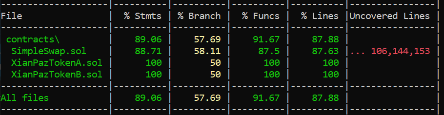

# SimpleSwap

A minimalistic swap user interface that allows to swap from XianPazA tokens to XianPazB tokens. Only this direction is available. 

## 🌐 Using the UI

When connecting to the wallet, it shows token balances and the price from the pool.

When user inputs the amount of XianPazA tokens to swap, it calculates the correlative amount of XianPazB tokens to receive (doing a call to the swap contract).

Finally, hitting the Swap button, an allowance is issued and then the swap operation. Once swap has been made, balances and price are updated.

You can find a live demo [here](https://simpleswapwithui.netlify.app/).

## 🚀 Implementation Details

In case you want to experiment in hardhat local node, please use `hardhat.local.config.js` as your `hardhat.config.js`. `hardhat.config.js` points to sepolia.

### Local Hardhat Environment

a) Run hardhat node

`npx hardhat node`: Starts a HTTP and WebSocket JSON-RPC server at http://127.0.0.1:8545/

b) Compile contracs in local node

`npx hardhat compile`

c) Deploy contracts in local node

`npx hardhat run scripts/deploy.js --network localhost`: Deploys each contract and builds the metadata used by the webapp, that is, the deploy address and the abi.

d) Mint tokens and add liquidy to the pool

`npx hardhat run scripts/addLiquidity.js --network localhost`

### Sepolia Environment

a) Environment Variables

In order to properly point to sepolia, you must provide the following addresses in your `.env` file:

`ALCHEMY_API_KEY` = API key for an alchemy node in Sepolia.
`SEPOLIA_PRIVATE_KEY` = Wallet address which will be used to deploy which needs to have enough gas to pay for them.
`ETHERSCAN_API_KEY` = API key used to verify contracts.

These settings will allow `hardhat.config.js` to direct to sepolia.

b) Compile contracs in local node

`npx hardhat compile`

c) Deploy contracts in local node

`npx hardhat run scripts/deploy.js --network sepolia`: Deploys each contract and builds the metadata used by the webapp, that is, the deploy address and the abi.

d) Mint tokens and add liquidy to the pool

`npx hardhat run scripts/addLiquidity.js --network sepolia`

### Web UI launch

a) Run in localhost

`node server.js`: This runs the server launching the swap UI in `localhost:3000`

b) Run in Netlify

`https://simpleswapwithui.netlify.app/`: The webapp is published in this public URL.

## 🤖 Contract Overview
SimpleSwap is a simple smart contract for token swaps and liquidity management, inspired by Uniswap v1. This contract allows users to:

- Add liquidity for a single token pair
- Remove liquidity proportionally
- Swap between two ERC20 tokens
- Query prices and output estimates

The repo contains the two token contracts:

- XianPazTokenA & XianPazTokenB: mintable ERC20s, 18 decimals created with openZeppelin library.

You can find these contracts deployed and verified in Sepolia in the following addresses:

- XianPazTokenA -> 0x231e356AaC9b22c313E8A0697d055453F226a153
- XianPazTokenB -> 0xB99512678b8aE7a9D31529C24716fA2d1e757Ac6
- SimpleSwap -> 0x78BaB5A34B32a8E0A0A537ffB176F03157477846

All contracts deployed with wallet address -> 0xB78A3BF33E12C5c61d117204A0cABFDb9B65776D

⚠️ **Note**: This implementation supports only one fixed pair of tokens, without fees. It's meant for learning, experimentation, and educational purposes—not production use.

---

## 📄 Contract Details

- **Token Pair**: Fixed at deployment via constructor (`tokenA`, `tokenB`)
- **Liquidity Tracking**: Custom liquidity shares tracked via internal bookkeeping
- **Formula**: Uses the constant product AMM formula: `x * y = k`
- **Fee**: No fee mechanism implemented
- **Math**: Includes custom `sqrt` and `min` helper functions

---

## 🛠 Public Functions

### `addLiquidity`

```solidity
function addLiquidity(
    address _tokenA,
    address _tokenB,
    uint amountADesired,
    uint amountBDesired,
    uint amountAMin,
    uint amountBMin,
    address to,
    uint deadline
) external returns (uint amountA, uint amountB, uint liquidity)
```

Adds tokenA and tokenB liquidity into the pool and receives liquidity shares.

**Parameters**:
* address _tokenA: Must be the address of tokenA
* address _tokenB: Must be the address of tokenB
* uint amountADesired: Amount of tokenA the user wants to deposit
* uint amountBDesired: Amount of tokenB the user wants to deposit
* uint amountAMin: Minimum acceptable amount of tokenA
* uint amountBMin: Minimum acceptable amount of tokenB
* address to: Address to credit with liquidity tokens
* uint deadline: Unix timestamp after which the transaction will revert

**Returns**:
* uint amountA: Actual amount of tokenA deposited
* uint amountB: Actual amount of tokenB deposited
* uint liquidity: Liquidity tokens minted

### `removeLiquidity`

```solidity
function removeLiquidity(
    address _tokenA,
    address _tokenB,
    uint liquidity,
    uint amountAMin,
    uint amountBMin,
    address to,
    uint deadline
) external returns (uint amountA, uint amountB)
```

Burns liquidity tokens and returns the user’s proportional share of reserves.

**Parameters**:
* address _tokenA: Must be the address of tokenA
* address _tokenB: Must be the address of tokenB
* uint liquidity: Amount of liquidity to remove
* uint amountAMin: Minimum acceptable amount of tokenA
* uint amountBMin: Minimum acceptable amount of tokenB
* address to: Address to receive withdrawn tokens
* uint deadline: Unix timestamp after which the transaction will revert

**Returns**:
* uint amountA: TokenA withdrawn
* uint amountB: TokenB withdrawn

### `swapExactTokensForTokens`

```solidity
function swapExactTokensForTokens(
    uint amountIn,
    uint amountOutMin,
    address[] calldata path,
    address to,
    uint deadline
) external returns (uint[] memory amounts)
```

Swaps a known amount of input tokens for as many output tokens as possible using the constant product formula.

**Parameters**:
* uint amountIn: Amount of input token to swap
* uint amountOutMin: Minimum acceptable amount of output token
* address[] path: Array of two token addresses [tokenA, tokenB] or [tokenB, tokenA]
* address to: Address to receive output tokens
* uint deadline: Unix timestamp after which the transaction will revert

**Returns**:
* uint[] amounts: [amountIn, amountOut]

### `getPrice`

```solidity
function getPrice(
    address _tokenA,
    address _tokenB
) external view returns (uint price)
```

Returns the current price ratio between tokenA and tokenB.

**Parameters**:
* address _tokenA: Address of input token
* address _tokenB: Address of output token

**Returns**:
* uint price: Exchange rate scaled by 1e18

### `getAmountOut`

```solidity
function getAmountOut(
    uint amountIn,
    uint reserveIn,
    uint reserveOut
) external pure returns (uint amountOut)
```

Calculates how many output tokens you get for a given input based on reserves.

**Parameters**:
* uint amountIn: Amount of input token
* uint reserveIn: Current reserve of input token
* uint reserveOut: Current reserve of output token

**Returns**:
* uint amountOut: Expected amount of output tokens

## 🧮 Internal Helpers

### `sqrt`

```solidity
function sqrt(uint y) internal pure returns (uint z)
```

Computes the square root of an integer.

**Parameters**:
* uint y: Value to compute the square root of

**Returns**:
* uint z: Resulting square root

### `min`

```solidity
function min(uint x, uint y) internal pure returns (uint)
```

Returns the smaller of two numbers.

**Parameters**:
* uint x: First number
* uint y: Second number

**Returns**:
* uint: Minimum value

---

## 🛠 Test Results

---

## 🛠 Test Coverage


